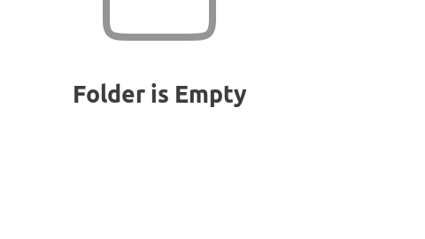

# Manuel de l'observateur pour THÉSÉE

## Cheklists
### Cheklist d'après-midi

- Ventiler le dôme : ouvrir la fente et ouvrir les panneaux. Faire attention à ce que le soleil ne rentre pas directement dans le dôme.
- Vérifier que le système est opérationnel : ouvrir le programme et vérifier que tout fonctionne (laser IR, caméra Andor, logiciel)
- Vérifier qu'on a un plan de nuit (objets de début, milieu et fin de nuit)
  - Coordonnées exacte des objets
  - Masse d'air au-dessus de 1.2 (idéalement): https://airmass.org/
  - Paramètres d'observation : filtre, nombre de pas, velocity target, opd de départ, opd de fin, temps d'exposition d'une frame

### Cheklist de début de nuit

- Miroir à la température extérieure: https://intranet.omm-astro.ca/meteo/
- Roue à filtre : est-ce que les filtres pour les observations de la nuit sont en place
- Faire un bout de cube laser pour vérifier que le système fonctionne et que tout est calibré:
  - Faire une Velocity calibration
  - Vérifier la position de la zpd (une seule grosse frange) et l'ajuster à 0 à l'aide du bouton `Reset OPD`
 
### Cheklist avant chaque observation

1. Focus sur les étoiles, idéalement pas trop loin de l'objet
2. Se mettre sur la cible et vérifier qu'on est bien centré
3. Mettre la sphère d'intégration, allumer le laser
4. Optimisation de l'efficacité de modulation
    - Ajuster DA-1 et DA-2 individuellement aligner le mirroir mobile
6. se mettre au départ de l'OPD (opd_min)
7. enlever la sphère d'intégration, éteindre le laser
8. optimiser le gain sur la cible et **le noter**
9. lancer le walk
    - vérifier les paramètres (velocity_target, opd_max)
10. lancer l'acquisition
    - vérifier que interval = 0 ms
    - vérifier les paramètres (exposure_time, step_nb)
    - entrer le nombre de pas (appuyer sur ENTER)
    - vérifier qu'on est dans le bon dossier

### Exemple de paramètres

- filtre trois-bandes (R=2000, 1h d'exposition)
  - velocity_target = 0.278 um/s
  - step_nb = 11 027
  - opd_min = -200 000 nm
  - opd_max = 799 714 nm
  - exposure_time = 0.33 s
- laser (20 min, R=1500)
  - velocity_target = 0.625 um/s
  - step_nb = 8270
  - opd_min = -149 935 nm
  - opd_max = 599 740 nm
  - exposure_time = 0.15 s

## Résolution de problèmes

- Trop grande OPD (beaucoup de franges)
  - retrouver un semblant de modulation (50% suffisant, il suffit de voir clairement des franges et que le centre des profils semblent suffisament plats)
  - config/SERVO_DA_LOOP_ENABLED = 0 (annule le suivi de l'efficacité de modulation)
 
